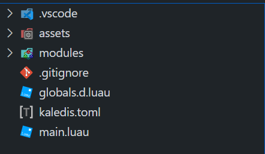

# Usage

by default [PATH] is the directory kaledis is executed on.

## `init`
Initializes a new Love2D project.
```sh
kaledis init [PATH]
```

It initiates the project with this files:
```
├───.vscode
├───assets
├───love
└───modules
```

## `build`
Transpiles the project and builds a .love file inside the '.build' directory.
```sh
kaledis build [PATH] -o
```
it will generate a folder looking like this:


## `compile`
Compiles the project into a executable inside the 'dist' folder.
```sh
kaledis compile [PATH] -o
```
The -o flag joins all files in a single one.

## `dev`
Watches for changes in your project, builds and executes love automatically/manual
```sh
kaledis dev [PATH]
```

## `update`
Tries to update to the latest release using github releases.
```sh
kaledis update
```